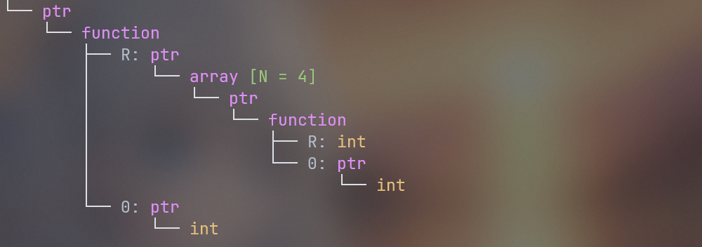
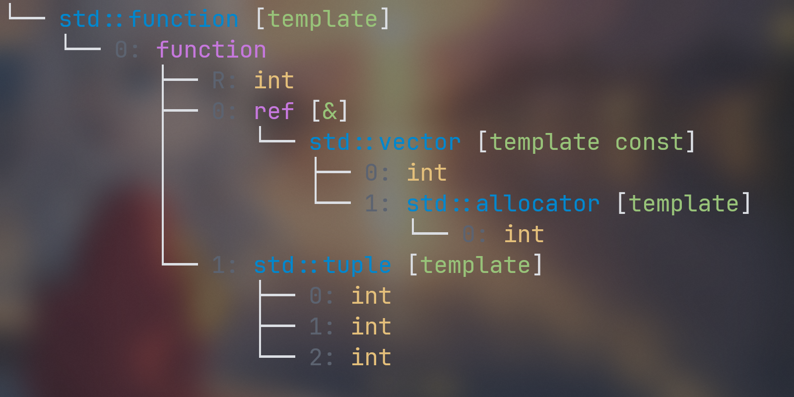
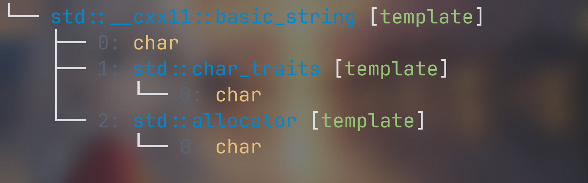
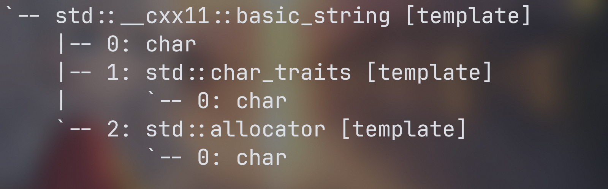

magic-cpp is a header-only C++ library. It aims to make it easier for you to use C++, including a series of functions such as visualizing type names, reflection of structs and enumerations, etc. It can help you get rid of the compiler's error messages which are difficult to read

[English](README.md) | [简体中文](README.zh.md)

- [Visualizing type](#visualizing-type)
  - [Basic usage](#basic-usage)
  - [Custom type name](#custom-type-name)
  - [Configurability](#configurability)
  - [Other features](#other-features)


# Visualizing type
`#include <magic/visualize.h>`to use features below, `C++17` is minimum required

## Basic usage
when using template programming, you often encounter the dilemma of type mismatch, especially when using libraries like `ranges`, templates are often deeply nested and difficult to read. Do not worry, `magic-cpp` can help you visualize the type, making it easier for human to understand the type. Consider the following example
```cpp
using T = int (*(*(*)(int*))[4])(int*); // hard to understand
std::cout << magic::visualize<T>() << std::endl;
```
Output:



Or you may encounter this when writing code
```cpp
using T = std::function<int(const std::vector<int>&, std::tuple<int, int, int>)>; // hard to understand
std::cout << magic::visualize<T>() << std::endl;
```
Output:



Almost all commonly used templates can be converted into such a tree representation, which is clear at a glance. Of course, the full expansion of some types is very long and not what you expected, for example, the output effect of `std::string` on `gcc` is like this



## Custom type name
As you can see, there is a lot of information we don't want to see. It doesn't matter! Provide a custom type name through explicit specialization
```cpp
template<>
struct magic::type_info<std::string>
{
    inline static std::string name = "std::string";
};
```
In this way, when encountering `std::string`, only the following will be displayed


It's the custom name, isn't it convenient? I have pre-defined some commonly used type aliases such as `std::size_t`, `std::string`, `std::vector` in `customization.h`. If you need it, you can try to modify or add it yourself

## Configurability
Considering that some terminals do not support color, or do not support `utf` characters, the display will appear garbled, so we provide options to turn off these functions
```cpp
magic::VisualizeOption option;
option.utf_support = false;     // do not use utf8 characters
option.color_support = false; // turn off color support
option.full_name = true;        // use full name instead of custom alias
std::cout << magic::visualize<std::string>(option) << std::endl;
```
Output:



if you want to customize the color scheme, you can use the `HighlightConfig` structure
```cpp
struct HighlightConfig
{
    std::uint32_t type;     // type: int, double, ...
    std::uint32_t nttp;     // non type template parameter: 1, 2, ...
    std::uint32_t tmpl;     // template: std::vector, ...
    std::uint32_t builtin;  // built-in compound type: ptr, ref...
    std::uint32_t modifier; // modifier: const, volatile, ...
    std::uint32_t tag;      // tag: R: , M: , ...
};

// 默认采用的配色方案是 Dark
constexpr static inline HighlightConfig Dark = {
    .type = 0xE5C07B,     // yellow
    .nttp = 0xD19A66,     // orange
    .tmpl = 0x0087CE,     // blue
    .builtin = 0xC678DD,  // purple
    .modifier = 0x98C379, // green
    .tag = 0x5C6370,      // gray
};

// there is also a built-in Light style color scheme
```
You can also customize the color scheme yourself, and then pass it to the `visualize` function
```cpp
magic::VisualizeOption option; // default option
std::cout << magic::visualize<std::string>(option, magic::Light) << std::endl;
```
## Other features
Besides visualizing types, we also support some other operations

retrieving a type's `display_name`
```cpp


```

retrieving `raw_name` in compile time
```cpp
template<typename T>
struct Point
{
    T start;
    T end;
};

// retrieving a type's raw_name
constexpr auto name = magic::raw_name_of<Point<int>>();
// name => "Point<int>"

// retrieving a non-type template parameter's raw_name
constexpr auto name2 = magic::raw_name_of<1>();
// name2 => "1"

// retrieving a template's raw_name
constexpr auto name3 = magic::raw_name_of_template<Point<int>>();
// name3 => "Point"

// retrieving a member's raw_name, C++20 or higher is required
Point point;
constexpr auto name4 = magic::raw_name_of_member<&point.start>();
// name4 => "start"

constexpr auto name5 = magic::raw_name_of_member<&point.end>();
// name5 => "end"


enum class Color
{
    RED,
    GREEN,
    BLUE,
};

// retrieving an enumeration's raw_name
constexpr auto name6 = magic::raw_name_of<Color::RED>();
// name6 => "RED"
```
Please note that the content obtained by these methods may be different on different compilers, please do not use them to build the core part of the code.