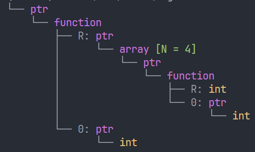
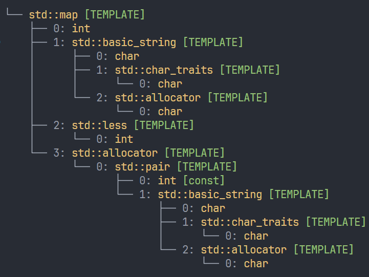
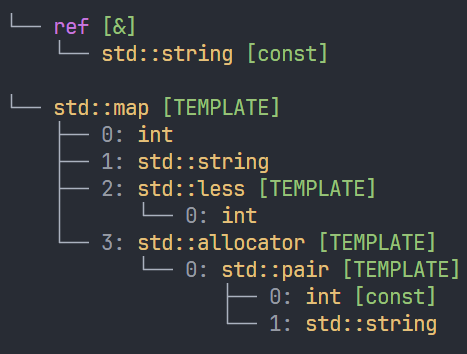

# Magic C++

`magic-c++`是一个轻量级`C++20`的`header-only`的库，利用一些特殊的技巧和模板元编程，提供了一些强大的功能。
- 对类型的反射（获取类型名，可视化类型）
- 对聚合结构体的反射（遍历结构体，根据索引获取结构体成员，获取字段名）
- 对枚举的反射（获取枚举名）

# 目录
- [Magic C++](#magic-c)
- [目录](#目录)
- [类型](#类型)
  - [获取类型名](#获取类型名)
  - [可视化类型](#可视化类型)
    - [示例一](#示例一)
    - [示例二](#示例二)
    - [特化](#特化)
  - [限制](#限制)
- [结构体反射](#结构体反射)
  - [使用](#使用)
  - [限制 \& 建议](#限制--建议)
  - [已知问题](#已知问题)
- [枚举反射 -- Todo](#枚举反射----todo)
  - [获取枚举名](#获取枚举名)
  - [遍历枚举](#遍历枚举)
  - [位域枚举](#位域枚举)
- [安装](#安装)
- [编译器支持](#编译器支持)
  


# 类型
包含`magic/type.h`即可使用结构体下面这些功能
## 获取类型名
使用`full_name_of`获取一个类型的名字，返回值类型是`magic::String`，是一个`std::vector<char>`的包装，可以直接输出
```c++
std::cout << full_name_of<std::string>() << std::endl;
// output: std::basic_string<char, std::char_traits<char>, std::allocator<char>>

std::cout << full_name_of<std::size_t>() << std::endl;
// output: unsigned long long int
```
这里会打印出类型的完全展开的形式，但是有时候我们不想要看见如此长的名字，可以通过显式提供特化来自定义显式
```c++
namespace magic
{
    template<>
    struct type_info<std::string>
    {
        constexpr static auto value = "std::string";
    };
}
```
然后使用`name_of`获取就可以获取到了
```c++
static_assert(name_of<std::string>() == "std::string");
static_assert(name_of<const std::string&>() == "const std::string&");

struct Point{};
static_assert(name_of<Point>() == "Point");
```
如果你还是想获取到完整的名字，继续使用`full_name_of`就行了，`type.h`中预先特化了一些标准库中的类型。例如`std::string`，`std::vector`等等，所以你不用手动去特化它们了
## 可视化类型
### 示例一
```cpp
#include <iostream>
#include <magic/type.h>

int main()
{
    using T = int (*(*(*)(int*))[4])(int*);
    std::cout << magic::tree_of<T>() << std::endl;
}
```
输出



测试
```c++
using A = int(*)(int*);
using B = A[4];
using C = B*;
using D = C(*)(int*);
static_assert(std::is_same_v<D, T>);
```
### 示例二
```cpp
#include <iostream>
#include <magic/type.h>

int main()
{
    using T = std::map<int, std::string>;
    std::cout << magic::full_tree_of<T>() << std::endl;
}
```


### 特化
同样这里也会受到`type_info`特化的影响
```cpp
int main()
{
    std::cout << magic::tree_of<const std::string&>() << std::endl;
    std::cout << magic::tree_of<std::map<int, std::string>>() << std::endl;
}
```


如果你不想受到特化的影响，只想查看类型完全展开的形式，可以使用`magic::full_tree_of`。

## 限制
由于`C++`暂时还没有`universal template`，所以没法统一的表示`NTTP`模板参数和`type`模板参数的所有可能的组合，所以只能手动枚举一些可能的组合，`4`个模板参数以下的`NTTP`和`type`的组合已经被枚举完了，全部都在`parse_template.ge`中。

# 结构体反射
包含`magic/struct.h`即可使用结构体下面这些功能

## 使用
```c++
using namespace magic;

struct Complex
{
    std::string name;
    std::vector<int> vec;
};
```

使用`field_count_of`获取结构体成员的数量
```c++
static_assert(field_count_of<Complex>() == 2);
```
使用`field_types_of`获取结构体的成员类型集合 返回一个 `tuple`
```c++
static_assert(std::same_as<
    field_types_of<Complex>, 
    std::tuple<std::string, std::vector<int>>
    >);
```
使用`field_type_of`获取指定位置的成员类型
```c++
static_assert(std::same_as<
    field_type_of<Complex, 0>, 
    std::string>);

static_assert(std::same_as<
    field_type_of<Complex, 1>, 
    std::vector<int>>);
```

使用`field_names_of`获取成员字段名 返回值类型是 `std::array<std::string_view, N>`
```c++
static_assert(
    field_names_of<Complex>() == 
    std::array<std::string_view, 2>{"name", "vec"});
```
请注意只有能够`default construct`的类型才能使用`field_names_of`获取字段名

使用`field_name_of`获取指定位置的成员字段名
```c++
static_assert(field_name_of<Complex>(0) == "name");
static_assert(field_name_of<Complex>(1) == "vec");
```

使用`field_of`获取指定位置的成员
```c++
int main()
{
    auto complex = Complex{"hello", {1, 2, 3}};
    std::cout << field_of<0>(complex) << std::endl;
    std::cout << field_of<1>(complex)[0] << std::endl;
    // output:
    // hello
    // 1
}
```

使用`foreach`遍历结构体的成员
```c++
int main()
{
    auto f = [](auto field)
    {
        constexpr auto index = field.index();
        constexpr auto name = field.name();
        using type = decltype(field)::type;
        if constexpr (name == "name")
        {
            std::cout << index << ": " << name << " " << field.value() << std::endl;
        }
        else if constexpr (name == "vec")
        {
            std::cout << index << ": " << name << " "
                      << field.value()[0]
                      << field.value()[1]
                      << field.value()[2] << std::endl;
        }

    };

    foreach (complex, f);
    // output:
    // 0: hello hello
    // 1: vec 123
}
```
## 限制 & 建议
首先只有聚合类型的结构体才能使用这些功能。除此之外，在自动搜索结构体字段数量的时候，如果你的结构体成员数量比较多，可能会实例化大量模板，从而超过模板递归深度的最大限制。你可以通过显式特化`type_info`并且提供`count`字段来避免这个问题，例如
```c++
namespace magic
{
    template<>
    struct type_info<Complex>
    {
        constexpr static auto count = 2;
    };
}
```
当然大多数时候这是不必要的。


另外支持的结构体成员数量是有限的，默认支持的数量是`32`个，如果你想要支持更多的数量，只需要运行`generate.py`并且传递`-f <count>`既可，`count`是你想要支持的最大数量，；例如
```bash
python generate.py -f 64
```
这将会支持最多`64`个成员的结构体，最终代码在`struct_bind_of_field_types.ge`和`struct_bind_of_field_names.ge`这两个文件中。你可以查看相关文件确保更改已经生效。

## 已知问题
- `gcc13`在结构体中含有引用类型的时候，自动获取成员数量会`ice`。**解决办法**，为含有引用类型的提供显式特化


# 枚举反射 -- Todo 
## 获取枚举名

## 遍历枚举

## 位域枚举

# 安装
只需要把`include`包含进你的项目即可
# 编译器支持
Clang > 16.0.0

GCC > 12.0.0

MSVC > 19.29.30038.1


