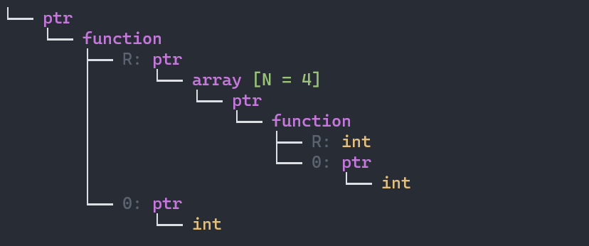

# Magic Cpp

Header-only C++20 library provides static reflection for type, aggregate class and enum, no external dependencies, no registration, no macro, no code generation, just magic.

## Documentation
* [Reference](doc/reference.md)
* [Limitations](doc/limitations.md)
* [Integration](#Integration)

## [Examples](example/)
### type

*just include `magic/type.h` to use these features*

* full name of type 
```cpp
struct Point{};
constexpr auto name = magic::full_name_of<Point>();
static_assert(name == "Point");

constexpr auto name2 = magic::full_name_of<std::vector<int>>();
static_assert(name2 == "std::vector<int, std::allocator<int>>");

constexpr auto name3 = magic::full_name_of<std::size_t>();
static_assert(name3 == "unsigned long long int");
```
* display name of type
```cpp
// specialization for type to get better readable
namespace magic
{
    template<>
    struct type_info<std::size_t>
    {
        constexpr static auto value = "std::size_t";
    };

    template<>
    struct type_info<std::string>
    {
        constexpr static auto value = "std::string";
    };
}

// use name_of to get the display name
constexpr auto name = magic::name_of<std::size_t>();
static_assert(name == "std::size_t");

constexpr auto name2 = magic::name_of<std::string>();
static_assert(name2 == "std::string");
```

* visualize type
```cpp
// for some complex type, it is hard to understand for human
// we can visualize it to a more readable form

using T = int (*(*(*)(int*))[4])(int*); // hard to understand
std::cout << magic::full_tree_of<T>() << std::endl;
```
Output:



```cpp
using T = std::map<int, std::string>;
std::cout << magic::full_tree_of<T>() << std::endl;
```
Output:


you can also use `tree_of` to get a more compact form, more details see [type](docs/type.md).

### [aggregate class](https://en.cppreference.com/w/cpp/language/aggregate_initialization#Definitions)
*just include `magic/struct.h` to use these features*

```cpp
struct Complex
{
    std::string name;
    std::vector<int> vec;
}; // Complex is an aggregate class
```

-  Retrieve field count of an aggregate class
```cpp
static_assert(magic::field_count_of<Complex>() == 2);
```
- Retrieve the field types for an aggregate class
```cpp
using T = magic::field_types_of<Complex>;
static_assert(std::same_as<T, std::tuple<std::string, std::vector<int>>>);
```
- Retrieve the field type at a given index for an aggregate class
```cpp
static_assert(std::same_as<magic::field_type_of<Complex, 0>, std::string>);
static_assert(std::same_as<magic::field_type_of<Complex, 1>, std::vector<int>>);
```
- Retrieve the field names for an aggregate class
```cpp
constexpr auto names = magic::field_names_of<Complex>();
static_assert(names == std::array<std::string_view, 2>{"name", "vec"});
```

- Retrieve the field name at a given index for an aggregate class
```cpp
static_assert(magic::field_name_of<Complex>(0) == "name");
static_assert(magic::field_name_of<Complex>(1) == "vec");
```

- Retrieve the field reference at a given index for an aggregate class
```cpp
Complex c{"hello", {1, 2, 3}};
std::cout << magic::field_of<0>(c) << std::endl;
// output: hello

std::cout << magic::field_of<1>(c)[1] << std::endl;
// output: 2
```

- Traverse all fields of an aggregate class
```cpp
Complex c{"hello", {1, 2, 3}};
auto f = [](auto field)
{

};
magic::foreach(c, f);
```
### enum
- Retrieve the enum count

- Retrieve the enum names

- Retrieve the enum nam

- Retrieve the bit field enum value