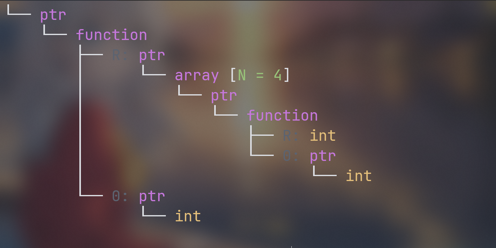

magic-cpp is C++20 header-only library provides static reflection for type, struct and enum, no external dependencies, no registration, no macro, no code generation. 

# Documentation
* [Reference](doc/reference.md)
* [Limitations](doc/limitations.md)
* [Integration](#Integration)

# [Examples](example/)
## type

**just include `magic/type.h` to use the features below**

- *retrieve the full name of a type*:
```cpp
struct Point{};

constexpr auto name = magic::full_name_of<Point>();
// name => "Point"

constexpr auto name2 = magic::full_name_of<std::vector<int>>();
// name2 => "std::vector<int>"

constexpr auto name3 = magic::full_name_of<std::size_t>();
// name3 => "unsigned long long int"
```
- *retrieve the display name of a type*
```cpp
// specialize for type to customize the display name
template<>
struct magic::type_info<std::size_t>
{
    constexpr static auto value = "std::size_t";
};

template<>
struct magic::type_info<std::string>
{
    constexpr static auto value = "std::string";
};

// use name_of to get the display name
constexpr auto name = magic::name_of<std::size_t>();
// name => "std::size_t"

constexpr auto name2 = magic::name_of<std::string>();
// name => "std::string"
```

- *visualize type*
```cpp
// for some complex type, it is hard to understand for human
// we can visualize it as a tree to make it more readable

using T = int (*(*(*)(int*))[4])(int*); // hard to understand
std::cout << magic::full_tree_of<T>() << std::endl;
```
*Output:*



----------------
```cpp
using T = std::map<int, std::string>;
std::cout << magic::full_tree_of<T>() << std::endl;
```
*Output*:


you can also use `tree_of` to get a more compact form, more details see [type](docs/type.md).

## [aggregate class](https://en.cppreference.com/w/cpp/language/aggregate_initialization#Definitions)
**just include `magic/struct.h` to use these features**

```cpp
struct Complex
{
    std::string name;
    std::vector<int> vec;
}; // Complex is an aggregate class
```

-  *retrieve field count of an aggregate class*
```cpp
constexpr auto count = magic::field_count_of<Complex>();
// count => 2
```
- *retrieve the field types for an aggregate class*
```cpp
using Types = magic::field_types_of<Complex>;
// Types => std::tuple<std::string, std::vector<int>>
```
- *retrieve the field type at a given index for an aggregate class*
```cpp
using First = magic::field_type_of<Complex, 0>;
// First => std::string

using Second = magic::field_type_of<Complex, 1>;
// Second => std::vector<int>
```
- *retrieve the field names for an aggregate class*
```cpp
constexpr auto names = magic::field_names_of<Complex>();
// names => std::array{"name", "vec"}
```

- *retrieve the field name at a given index for an aggregate class*
```cpp
constexpr auto name1 = magic::field_name_of<Complex>(0);
// name1 => "name"

constexpr auto name2 = magic::field_name_of<Complex>(1);
// name2 => "vec"
```

- *retrieve the field reference at a given index for an aggregate class*
```cpp
Complex c{"hello", {1, 2, 3}};

auto& value = magic::field_of<0>(c);
// value => "hello"

auto& value2 = magic::field_of<1>(c);
// value2 => std::vector{1, 2, 3}
```

- *traverse all fields of an aggregate class*
```cpp
auto f = [](auto field)
{
    constexpr auto index = field.index();
    constexpr auto name = field.name();
    using type = decltype(field)::type;
    if constexpr (name == "name")
    {
        std::cout << "index: " << index
                  << ", name: " << name
                  << ", value: " << field.value() << std::endl;
    }
    else if constexpr (name == "vec")
    {
        std::cout << "index: " << index
                  << ", name: " << name
                  << ", value: " << field.value()[0] << std::endl;
    }
};

magic::foreach (complex, f);
// out =>
// index: 0, name: name, value: hello
// index: 1, name: vec, value: 1
```
## enum
**just include `magic/enum.h` to use these features**
```cpp
enum Color
{
    RED,
    GREEN,
    BLUE
};
```
- *retrieve the enum count*
```cpp
constexpr auto count = magic::enum_count_of<Color>();
// count => 3
```
- *retrieve the enum names*
```cpp
constexpr auto& names = magic::enum_names_of<Color>();
// names => std::array{"RED", "GREEN", "BLUE"}
```
- *retrieve the enum name*
```cpp
constexpr auto name = magic::name_of<Color::RED>();
// name => "RED"

Color color = Color::GREEN;
auto name2 = magic::name_of(color);
// name => "GREEN"
```
- *retrieve the bit field enum value*
```cpp


```

- *traverse all enum values*
```cpp

```

# Limitations

# Support
- `gcc` > 12
- `clang` > 15
- `msvc` > 19.29