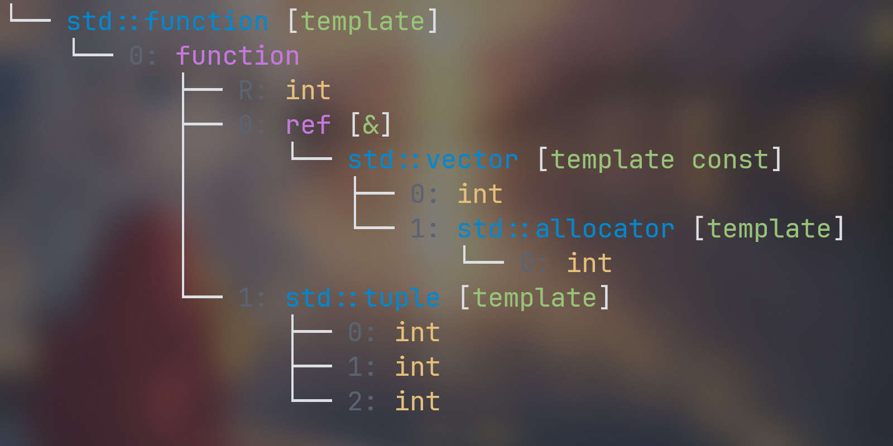
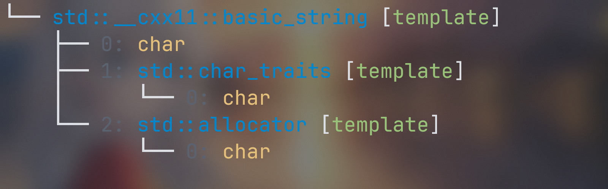

`magic-cpp`是一个 `header-only`的库，它旨在让您更加方便的使用`C++`，包括了可视化类型名，对结构体枚举的反射等一些列功能，它能帮摆脱那难以阅读的编译器报错信息

[English](README.md) | [简体中文](README.zh.md)

- [可视化类型](#可视化类型)
  - [基本使用](#基本使用)
  - [自定义类型名](#自定义类型名)
  - [可配置性](#可配置性)
  - [其他功能](#其他功能)

# 可视化类型
`#include <magic/visualize.h>`即可使用本小节的内容，最低版本要求`C++17`

## 基本使用
在使用模板编程的时候常常遇到类型不匹配的困境，尤其是使用像`ranges`这样的库的时候，模板常常深层嵌套难以阅读。没关系，`magic-cpp`可以帮助你可视化类型，让你更加方便的理解类型，考虑下面这个示例
```cpp
using T = int (*(*(*)(int*))[4])(int*); // 非常难以理解
std::cout << magic::visualize<T>() << std::endl;
```
输出效果:


或者在平常写代码的时候也可能遇到的
```cpp
using T = std::function<int(const std::vector<int>&, std::tuple<int, int, int>)>; // 非常难以理解
std::cout << magic::visualize<T>() << std::endl;
```
输出效果:



几乎常用的所有模板都可以转换这样的树状表示，一目了然有没有。当然有有些类型的完全展开是很冗长，并且不是你期待的样子的，例如`std::string`在`gcc`上的输出效果是这样的



## 自定义类型名
可以看到，有很多我们不希望看见的信息，没关系！通过显式特化提供自定义的类型名即可
```cpp
template<>
struct magic::type_info<std::string>
{
    inline static std::string name = "std::string";
};
```
这样的话遇到`std::string`就只会显示


它自定义的名字了，是不是很方便呢？我已经预先在`customization.h`预先定义好了一些`std::size_t`，`std::string`，`std::vector`等常用类型的别名，如果有需要你可以自己尝试修改或者添加

## 可配置性
考虑到有的终端并不支持彩色，或者不支持`utf`字符，这样的话显示就出出现乱码，所以我们提供选项来关闭这些功能
```cpp
magic::VisualizeOption option;
option.UTF8_SUPPORT = false;     // 不使用utf8字符
option.COLORFUL_SUPPORT = false; // 关闭彩色支持
option.FULL_NAME = true;        // 使用全名而不是自定义的别名
std::cout << magic::visualize<std::string>(option) << std::endl;
```


如果你的终端是支持彩色的，那么也可以自定义高亮，而不是选择我们默认的配色方案
```cpp
struct HighlightConfig
{
    std::uint32_t type;     // 类型: int, double, ...
    std::uint32_t nttp;     // 非类型模板参数: 1, 2, ...
    std::uint32_t tmpl;     // 模板: std::vector, ...
    std::uint32_t builtin;  // 内置复合类型: ptr, ...
    std::uint32_t modifier; // 修饰符: const, volatile, ...
    std::uint32_t tag;      // 标记: R: , M: , ...
};

// 默认采用的配色方案是 Dark
constexpr static inline HighlightConfig Dark = {
    .type = 0xE5C07B,     // 黄色
    .nttp = 0xD19A66,     // 橙色
    .tmpl = 0x0087CE,     // 蓝色
    .builtin = 0xC678DD,  // 紫色
    .modifier = 0x98C379, // 绿色
    .tag = 0x5C6370,      // 灰色
};

// 还有一套内置的 Light 风格的配色方案选择
```
直接将其作为第二个函数参数传入即可
```cpp
magic::VisualizeOption option; // 默认选项
std::cout << magic::visualize<std::string>(option, magic::Light) << std::endl;
```
## 其他功能
除了可视化类型以外，我们还支持其它的一些操作

获取类型的`display_name`
```cpp


```

编译期获取类型，非类型模板参数，模板，枚举，成员的`raw_name`
```cpp
template<typename T>
struct Point
{
    T start;
    T end;
};

// 获取类型的raw_name
constexpr auto name = magic::raw_name_of<Point<int>>();
// name => "Point<int>"

// 获取非类型模板参数的raw_name
constexpr auto name2 = magic::raw_name_of<1>();
// name2 => "1"

// 获取模板的raw_name
constexpr auto name3 = magic::raw_name_of_template<Point<int>>();
// name3 => "Point"

// 获取成员的raw_name，需要 C++20 或者更高版本
Point point;
constexpr auto name4 = magic::raw_name_of_member<&point.start>();
// name4 => "start"

constexpr auto name5 = magic::raw_name_of_member<&point.end>();
// name5 => "end"


enum class Color
{
    RED,
    GREEN,
    BLUE,
};

// 获取枚举的raw_name
constexpr auto name6 = magic::raw_name_of<Color::RED>();
// name6 => "RED"
```
请注意，这些方式获取到的内容在不同编译器上可能不同，请不要用它们构建核心部分的代码。


