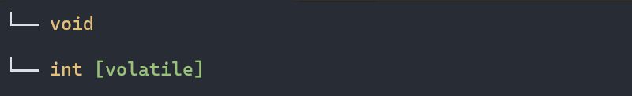
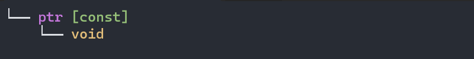
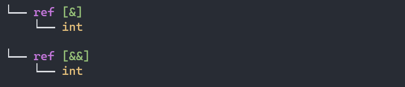
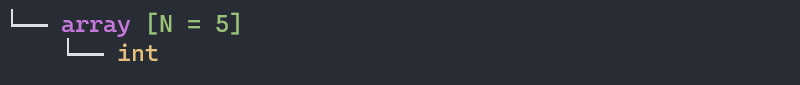
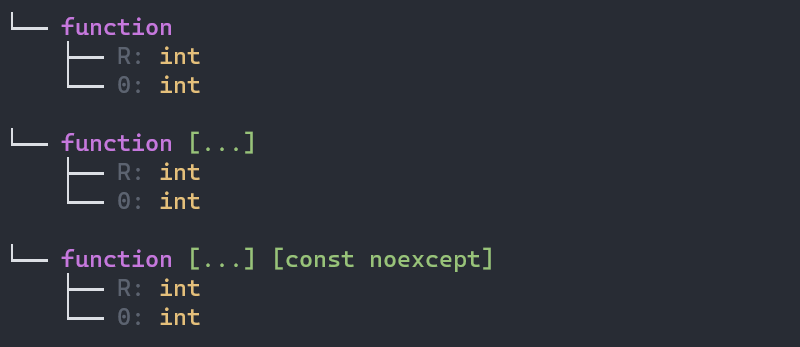
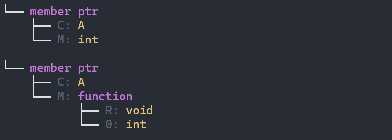
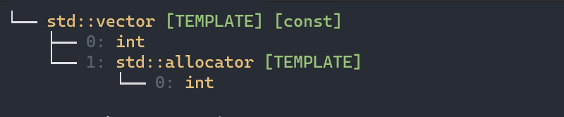

# Color
- `purple color` represents the builtin compound type.

- `yellow color` represents the type.

- `green color` represents the type modifier.

- `orange color` represents the nttp template parameter.

# visualize
## [basic type](https://en.cppreference.com/w/cpp/language/types)
```cpp
full_tree_of<void>();
full_tree_of<volatile bool>();
```


## [pointer type](https://en.cppreference.com/w/cpp/language/pointer)
```cpp
full_tree_of<void* const>();
```


the children node of `por` is the `pointed type`

## [reference type](https://en.cppreference.com/w/cpp/language/reference)
```cpp
full_tree_of<int&>();
full_tree_of<int&&>();
```


the `&` means `lvalue reference`

the `&&` means `rvalue reference`

the children node of `ref` is the `referenced type`

## [array type](https://en.cppreference.com/w/cpp/language/array)
```cpp
full_tree_of<int[3]>();
```

the `N` means the `array size`

the children node of `array` is the `element type`


## [function type](https://en.cppreference.com/w/cpp/language/function#Function_type)
```cpp
full_tree_of<int(int)>();
full_tree_of<int(int, int, ...)>();
full_tree_of<int(int, ...) const noexcept>();
```


the `R` means the `return type`

the `<index>:` means the `parameter type` 

the `[...]` means `C style variadic parameter`

besides, the possible modifiers include `const`, `volatile`, `&`, `&&`, `noexcept`

## [member ptr](https://en.cppreference.com/w/cpp/language/pointer#Pointers_to_members)
```cpp
struct A
{
    int a;
    void f(int){}
}

full_tree_of<decltype(&A::a)>();
full_tree_of<decltype(&A::f)>();
```


the `C` means the `class type`

the `M` means the `member type`

## [template](https://en.cppreference.com/w/cpp/language/class_template)
```cpp
full_tree_of<const std::vector<int>>();
```


the `template` represents the node is `template template type`

# specialization